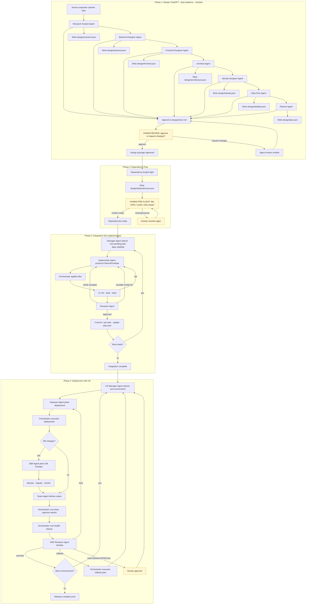

# AI Dev Tasks

## 1) Project Overview

**AI Dev Tasks** is a schema-first, orchestrator-driven framework that turns a feature idea into deployed code through four phases:

1. **Design Phase (ChatGPT) — dual-audience & modular**
   - Executed by a **team of specialized agents**, each producing two deliverables:
     - **Human-oriented spec sections** → appended to `/design/docs/<feature>.md` for stakeholders.  
     - **Machine-oriented artifacts** → `/design/*.json`, validated against `/specs/*.schema.json`, for automation.  
   - **Agents and responsibilities:**
     - **Research Analyst Agent** → *Product Research & Prospectus*: market, competitors, TAM/SAM/SOM, pricing, **cost-to-deliver**, **margin projections**.  
       - Human: prospectus narrative.  
       - AI: `research.json`.  
     - **Backend Designer Agent** → *Backend Design*: processing flows, data models, APIs, storage/scaling trade-offs.  
       - Human: backend design section.  
       - AI: `backend.json`.  
     - **Frontend Designer Agent** → *Frontend Design*: pages, components, flows, accessibility, wireframes/mermaid diagrams.  
       - Human: UI/UX section.  
       - AI: `frontend.json`.  
     - **Architect Agent** → *Architecture Design*: hosted environment, deployment topology, infra dependencies.  
       - Human: architecture diagrams/overview.  
       - AI: `architecture.json`.  
     - **Identity Designer Agent** → *Identity Design*: authn/authz, roles, MFA, IdP integration.  
       - Human: identity design section.  
       - AI: `identity.json`.  
     - **Data Flow Agent** → *Data Flow Diagrams*: request/data lifecycles across components.  
       - Human: sequence/data flow diagrams.  
       - AI: `dataflow.json`.  
     - **Planner Agent** → *Execution Plan*: consolidate modules into a task DAG.  
       - Human: roadmap section.  
       - AI: `plan.json`.  
   - **Iteration protocol:** one agent runs → produce dual outputs → stakeholder approves human doc → commit → move to next agent.  
     The final design doc is all sections combined; JSON artifacts form execution contracts.

2. **Dependency Prep Phase (Human + ChatGPT support)**
   - **Goal:** ensure all external/environmental dependencies are defined and ready before Integration.  
   - **Deliverables:**
     - Human-oriented *Dependencies Checklist* → appended to `/design/docs/<feature>.md`.  
     - Machine artifact: `dependencies.json` (validates `/specs/Dependencies.schema.json`) listing:
       - required libraries, APIs, services, credentials, infra resources,  
       - each marked as `available`, `missing`, or `manual` (human action needed).  
   - **Responsibilities:**
     - Humans confirm environment readiness (e.g., DB seeded, cloud resources provisioned).  
     - Planner Agent updates `plan.json` so tasks include explicit `depends_on` references to `dependencies.json`.  
   - **Result:** Integration won’t start until required dependencies are marked “available,” preventing AI tasks from failing due to missing prerequisites.

3. **Integration Phase (n8n implementation) — agentic build loop**
   - This phase is run by a **set of implementation agents** under n8n orchestration.  
   - **Agents and responsibilities:**
     - **Manager Agent** → reads `plan.json`, selects first `pending` task with dependencies met.  
     - **Implementor Agent** → produces a `ReturnEnvelope` (validates `/specs/ReturnEnvelope.schema.json`) with diff, files, tests, costs, notes.  
     - **Reviewer Agent** → validates acceptance criteria, scope, CI results; issues verdict (`approved`, `needs_changes`, `escalate`).  
     - **CI Gate** → runs lint, tests, build, and optional static analysis.  
   - **Iteration protocol:**
     1. Manager selects next task.  
     2. Implementor produces ReturnEnvelope.  
     3. Orchestrator applies files, runs CI.  
     4. Reviewer issues verdict → approve/needs_changes/escalate.  
     5. Loop until all tasks are completed or skipped (idempotency satisfied).  
   - **Outputs:**
     - One commit per task (message: `Task <id>: <title>`).  
     - Updated `plan.json` with statuses.  
     - `/state/runs/<run-id>/task-<id>.json` snapshots for audit/resume.  
   - **Quality gates:** schema compliance, passing tests, minimal diffs, idempotency enforcement.

4. **Deployment Phase (n8n CD) — controlled promotion & rollback**
   - After Integration lands code, the Deployment Phase promotes a built artifact across environments safely and audibly.  
   - **Agents and responsibilities:**
     - **CD Manager Agent** → reads `release.json`, selects next environment, enforces order, respects approvals.  
     - **Deployer Agent** → produces `DeployEnvelope` (validates `/specs/DeployEnvelope.schema.json`) with strategy, commands/Helm values, rollback plan.  
     - **DBA Agent** → produces `DBChangeEnvelope` (validates `/specs/DBChangeEnvelope.schema.json`), ensures backups, migrations, rollback.  
     - **Tester Agent** → produces `TestReport` specs (validates `/specs/TestReport.schema.json`); orchestrator executes suites and captures results.  
     - **SRE Reviewer Agent** → verdict: `promote`, `retry`, `rollback`, or `hold`.  
   - **Iteration protocol:**
     1. CD Manager picks next environment.  
     2. Deployer plans; orchestrator executes deploy.  
     3. DBA handles backups/migrations if defined.  
     4. Tester defines/runs suites, produces TestReports.  
     5. Health checks run; results attached to DeployEnvelope.  
     6. SRE Reviewer issues verdict.  
     7. Loop until all environments are promoted or halted.  
   - **Outputs:**
     - DeployEnvelope per environment.  
     - DBChangeEnvelope for migrations.  
     - TestReports for suites.  
     - Logs/artifacts under `/state/cd/<run-id>/<env>/`.  
     - Final release status (successful prod or rollback summary).  
   - **Quality gates:** schema compliance, test pass, health checks within budgets, rollback plan required for prod, approvals honored.

### Principles
- **Schema-first:** all artifacts must validate against `/specs/*.schema.json`.  
- **Orchestrator-driven:** agents only plan; n8n performs side effects.  
- **Dual-audience design:** humans get a stakeholder-readable spec; AI gets machine contracts.  
- **Auditable & resumable:** design lives in `/design/`; runtime artifacts in `/state/`.

### Who this is for
- Product teams needing both stakeholder clarity and deterministic automation.  
- Engineers wanting CI-gated, resumable AI-driven implementation.  
- SREs/Leads needing deployment gates, rollback, and audit trails.

### Why this exists
- To connect **business viability** (prospectus with explicit margins) → **technical design** (backend, frontend, architecture, identity, data flows, dependencies) → **delivery** (integration and deployment) with safety and predictability.

