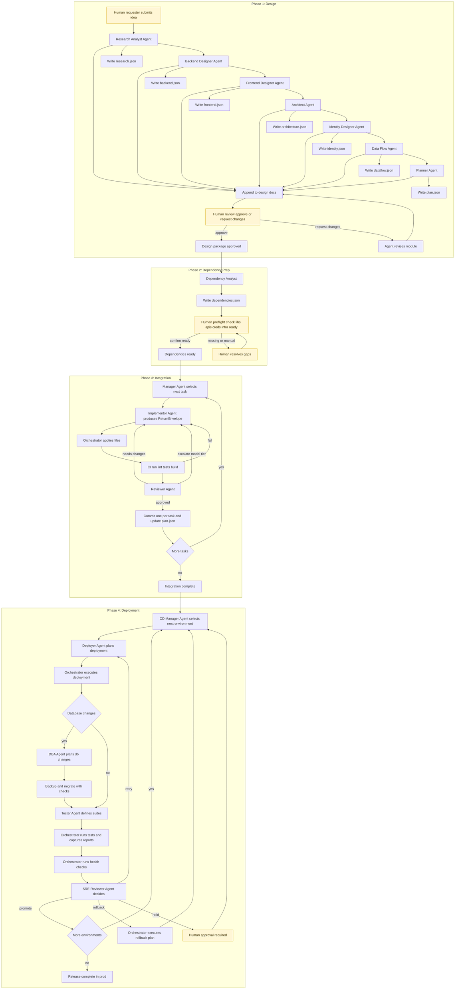
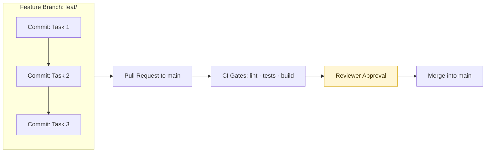
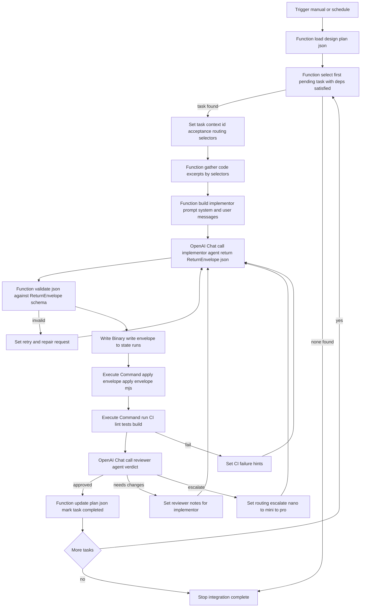
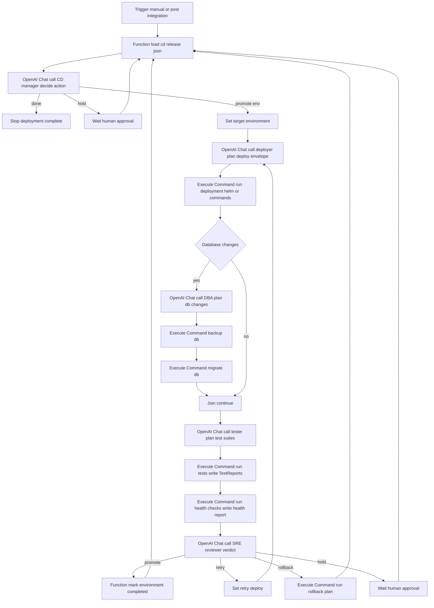

# AI Dev Tasks

## 1) Project Overview

### Repository Structure

- `design/` - human design docs and machine artifacts
- `cd/` - deployment plans
- `docs/runs/` - audit snapshots of completed runs
- `state/` - runtime state (gitignored)

**AI Dev Tasks** is a schema-first, orchestrator-driven framework that turns a feature idea into deployed code through four phases:

1. **Design Phase (ChatGPT) — dual-audience & modular**
   - Executed by a **team of specialized agents**, each producing two deliverables:
     - **Human-oriented spec sections** → appended to `/design/docs/<feature>.md` for stakeholders.  
     - **Machine-oriented artifacts** → `/design/*.json`, validated against `/specs/*.schema.json`, for automation.  
   - **Agents and responsibilities:**
     - **Research Analyst Agent** → *Product Research & Prospectus*: market, competitors, TAM/SAM/SOM, pricing, **cost-to-deliver**, **margin projections**.  
       - Human: prospectus narrative.  
       - AI: `research.json`.  
     - **Backend Designer Agent** → *Backend Design*: processing flows, data models, APIs, storage/scaling trade-offs.  
       - Human: backend design section.  
       - AI: `backend.json`.  
     - **Frontend Designer Agent** → *Frontend Design*: pages, components, flows, accessibility, wireframes/mermaid diagrams.  
       - Human: UI/UX section.  
       - AI: `frontend.json`.  
     - **Architect Agent** → *Architecture Design*: hosted environment, deployment topology, infra dependencies.  
       - Human: architecture diagrams/overview.  
       - AI: `architecture.json`.  
     - **Identity Designer Agent** → *Identity Design*: authn/authz, roles, MFA, IdP integration.  
       - Human: identity design section.  
       - AI: `identity.json`.  
     - **Data Flow Agent** → *Data Flow Diagrams*: request/data lifecycles across components.  
       - Human: sequence/data flow diagrams.  
       - AI: `dataflow.json`.  
     - **Planner Agent** → *Execution Plan*: consolidate modules into a task DAG.  
       - Human: roadmap section.  
       - AI: `plan.json`.  
   - **Iteration protocol:** one agent runs → produce dual outputs → stakeholder approves human doc → commit → move to next agent.  
     The final design doc is all sections combined; JSON artifacts form execution contracts.

2. **Dependency Prep Phase (Human + ChatGPT support)**
   - **Goal:** ensure all external/environmental dependencies are defined and ready before Integration.  
   - **Deliverables:**
     - Human-oriented *Dependencies Checklist* → appended to `/design/docs/<feature>.md`.  
     - Machine artifact: `dependencies.json` (validates `/specs/Dependencies.schema.json`) listing:
       - required libraries, APIs, services, credentials, infra resources,  
       - each marked as `available`, `missing`, or `manual` (human action needed).  
   - **Responsibilities:**
     - Humans confirm environment readiness (e.g., DB seeded, cloud resources provisioned).  
     - Planner Agent updates `plan.json` so tasks include explicit `depends_on` references to `dependencies.json`.  
   - **Result:** Integration won’t start until required dependencies are marked “available,” preventing AI tasks from failing due to missing prerequisites.

3. **Integration Phase (n8n implementation) — agentic build loop**
   - This phase is run by a **set of implementation agents** under n8n orchestration.  
   - **Agents and responsibilities:**
     - **Manager Agent** → reads `plan.json`, selects first `pending` task with dependencies met.  
     - **Implementor Agent** → produces a `ReturnEnvelope` (validates `/specs/ReturnEnvelope.schema.json`) with diff, files, tests, costs, notes.  
     - **Reviewer Agent** → validates acceptance criteria, scope, CI results; issues verdict (`approved`, `needs_changes`, `escalate`).  
     - **CI Gate** → runs lint, tests, build, and optional static analysis.  
   - **Iteration protocol:**
     1. Manager selects next task.  
     2. Implementor produces ReturnEnvelope.  
     3. Orchestrator applies files, runs CI.  
     4. Reviewer issues verdict → approve/needs_changes/escalate.  
     5. Loop until all tasks are completed or skipped (idempotency satisfied).  
   - **Outputs:**
     - One commit per task (message: `Task <id>: <title>`).  
     - Updated `plan.json` with statuses.  
     - `/state/runs/<run-id>/task-<id>.json` snapshots for audit/resume.  
   - **Quality gates:** schema compliance, passing tests, minimal diffs, idempotency enforcement.

4. **Deployment Phase (n8n CD) — controlled promotion & rollback**
   - After Integration lands code, the Deployment Phase promotes a built artifact across environments safely and audibly.  
   - **Agents and responsibilities:**
     - **CD Manager Agent** → reads `release.json`, selects next environment, enforces order, respects approvals.  
     - **Deployer Agent** → produces `DeployEnvelope` (validates `/specs/DeployEnvelope.schema.json`) with strategy, commands/Helm values, rollback plan.  
     - **DBA Agent** → produces `DBChangeEnvelope` (validates `/specs/DBChangeEnvelope.schema.json`), ensures backups, migrations, rollback.  
     - **Tester Agent** → produces `TestReport` specs (validates `/specs/TestReport.schema.json`); orchestrator executes suites and captures results.  
     - **SRE Reviewer Agent** → verdict: `promote`, `retry`, `rollback`, or `hold`.  
   - **Iteration protocol:**
     1. CD Manager picks next environment.  
     2. Deployer plans; orchestrator executes deploy.  
     3. DBA handles backups/migrations if defined.  
     4. Tester defines/runs suites, produces TestReports.  
     5. Health checks run; results attached to DeployEnvelope.  
     6. SRE Reviewer issues verdict.  
     7. Loop until all environments are promoted or halted.  
   - **Outputs:**
     - DeployEnvelope per environment.  
     - DBChangeEnvelope for migrations.  
     - TestReports for suites.  
     - Logs/artifacts under `/state/cd/<run-id>/<env>/`.  
     - Final release status (successful prod or rollback summary).  
   - **Quality gates:** schema compliance, test pass, health checks within budgets, rollback plan required for prod, approvals honored.

### Principles
- **Schema-first:** all artifacts must validate against `/specs/*.schema.json`.  
- **Orchestrator-driven:** agents only plan; n8n performs side effects.  
- **Dual-audience design:** humans get a stakeholder-readable spec; AI gets machine contracts.  
- **Auditable & resumable:** design lives in `/design/`; runtime artifacts in `/state/`.

### Who this is for
- Product teams needing both stakeholder clarity and deterministic automation.  
- Engineers wanting CI-gated, resumable AI-driven implementation.  
- SREs/Leads needing deployment gates, rollback, and audit trails.

### Why this exists
- To connect **business viability** (prospectus with explicit margins) → **technical design** (backend, frontend, architecture, identity, data flows, dependencies) → **delivery** (integration and deployment) with safety and predictability.



## 2) What’s New in this Version

This version represents a major step forward from earlier iterations of AI Dev Tasks.  
The core updates are:

- **Four-Phase Lifecycle**  
  Previously the lifecycle was 3 phases. We now explicitly split out a **Dependency Prep Phase** between Design and Integration.  
  • Design → Dependency Prep → Integration → Deployment.  
  • This ensures Integration only begins once all external prerequisites are confirmed ready.

- **Dual-Audience Design Deliverables**  
  The Design Phase now always produces:  
  • **Human-oriented documentation** (`/design/docs/<feature>.md`) for stakeholders to read, understand, and approve.  
  • **Machine-oriented JSON artifacts** (`/design/*.json`) that validate against strict schemas for automation.  
  Stakeholders get clarity up front; AI agents get precise execution contracts.

- **Expanded Design Agents**  
  Design Phase is modular, with specialized agents covering:  
  • Product Research & Prospectus (including margin analysis),  
  • Backend Design, Frontend Design, Architecture, Identity, Data Flows,  
  • Planner for the execution DAG.  
  Each agent works iteratively, so the design spec grows step by step with human review.

- **Dependency Management**  
  New `dependencies.json` artifact and *Dependencies Checklist* section in the human doc.  
  Humans confirm availability of libraries, services, APIs, credentials, or infra before Integration starts.  
  Tasks in `plan.json` now explicitly reference these dependencies.

- **Clearer Integration Loop**  
  Integration Phase now lists Manager, Implementor, Reviewer, and CI as distinct agents/steps, each with specific responsibilities.  
  Escalation paths (e.g., `nano → mini → pro` model tiers) are explicitly documented.

- **Deployment Agents and Safeguards**  
  Deployment Phase now specifies:  
  • CD Manager, Deployer, DBA, Tester, SRE Reviewer.  
  • Deliverables: `DeployEnvelope`, `DBChangeEnvelope`, `TestReport`.  
  • Environment-by-environment promotion (dev → test → stage → prod) with rollback, retries, and manual holds.

- **Auditability and Resume Safety**  
  • All artifacts are committed to `/design/` and `/state/` with strict schema validation.  
  • Integration and Deployment can be restarted at any time and will resume from the last known state.  
  • Human gates (reviews, approvals, pre-flight checks) are explicit in the workflow and visible in the Mermaid diagram.

## 3) Architecture at a Glance

The workflow is structured around four phases.  
Each phase has **clear roles**, **human touch points**, and **explicit artifacts** that become inputs to the next phase.

### Phase 1: Design
- **Who acts:** Research Analyst, Backend Designer, Frontend Designer, Architect, Identity Designer, Data Flow, and Planner agents.  
- **Human role:** requester provides context, stakeholders review and approve each design section.  
- **Artifacts produced:**  
  - `/design/docs/<feature>.md` → stakeholder-readable design document (sections for research, backend, frontend, architecture, identity, data flows, roadmap).  
  - `/design/research.json`  
  - `/design/backend.json`  
  - `/design/frontend.json`  
  - `/design/architecture.json` (validates `/specs/Architecture.schema.json`)  
  - `/design/identity.json`  
  - `/design/dataflow.json`  
  - `/design/plan.json` (validates `/specs/Plan.schema.json`)  

### Phase 2: Dependency Prep
- **Who acts:** Dependency Analyst (light agent) + humans confirming readiness.  
- **Human role:** check availability of libraries, APIs, credentials, and infra; resolve gaps flagged as “manual.”  
- **Artifacts produced:**  
  - `/design/docs/<feature>.md` → updated with a “Dependencies Checklist.”  
  - `/design/dependencies.json` (validates `/specs/Dependencies.schema.json`) → structured list of dependencies with status = `available`, `missing`, or `manual`.  

### Phase 3: Integration
- **Who acts:** Manager, Implementor, Reviewer, CI gate.  
- **Human role:** optional intervention if Reviewer escalates or if design/plan adjustments are needed.  
- **Artifacts produced:**  
  - Commits: one per task, branch = `feat/<slug>`.  
  - `/design/plan.json` → updated as tasks progress (`pending`, `in_progress`, `completed`, `skipped`).  
  - `/state/runs/<run-id>/task-<id>.json` (gitignored) → ReturnEnvelope objects (validates `/specs/ReturnEnvelope.schema.json`) containing diffs, files, tests, costs, and notes.  

### Phase 4: Deployment
- **Who acts:** CD Manager, Deployer, DBA, Tester, SRE Reviewer.  
- **Human role:** approvals when `hold_for_approval=true`, and sign-off on production if required.  
- **Artifacts produced:**  
  - `/cd/release.json` (validates `/specs/ReleasePlan.schema.json`) → ReleasePlan describing environments, strategies, health budgets, test suites, DB changes.  
  - `/state/cd/<run-id>/<env>/deploy.json` → DeployEnvelope (validates `/specs/DeployEnvelope.schema.json`) with strategy, executed steps, health, rollback plan.  
  - `/state/cd/<run-id>/<env>/db.json` → DBChangeEnvelope (validates `/specs/DBChangeEnvelope.schema.json`) with migrations, backup, rollback status.  
  - `/state/cd/<run-id>/<env>/tests.json` → TestReports (validates `/specs/TestReport.schema.json`) with pass/fail counts and artifacts.  
  - Logs and execution details under `/state/cd/<run-id>/<env>/`.  

---

**Summary:**  
- **Design** → `/design/docs/<feature>.md` + JSON specs under `/design/`.  
- **Dependency Prep** → `/design/dependencies.json` + checklist in docs.  
- **Integration** → commits, updated `/design/plan.json`, and ReturnEnvelopes in `/state/runs/`.  
- **Deployment** → `release.json` plus per-environment DeployEnvelope, DBChangeEnvelope, TestReports, and logs in `/state/cd/`.

Together, these artifacts make the process **predictable, auditable, and resumable** from idea through production.

## 4) State & Idempotency

A core design principle of AI Dev Tasks is that **every phase is resumable** and **every action is idempotent**.  
This means the workflow can be stopped and restarted without losing progress, and repeated actions do not create conflicts or duplication.

### 4.1 State Tracking

Each phase maintains explicit state in versioned or gitignored artifacts:

- **Design Phase**  
  - Human docs: `/design/docs/<feature>.md`  
  - JSON specs: `/design/*.json` (e.g., `research.json`, `backend.json`, `frontend.json`, `plan.json`)  
  - Status: stakeholder approval recorded in the doc itself and in commits.

- **Dependency Prep Phase**  
  - `/design/dependencies.json` — structured list of prerequisites with status.  
  - Updates: as dependencies move from `missing` → `available`, the file is updated and committed.

- **Integration Phase**  
  - `/design/plan.json` — authoritative task plan; each task has `status` = `pending`, `in_progress`, `completed`, or `skipped`.  
  - `/state/runs/<run-id>/task-<id>.json` (gitignored) — snapshot of every ReturnEnvelope generated for a task.  
  - Git commits — exactly one per completed task on the feature branch.  

- **Deployment Phase**  
  - `/cd/release.json` — authoritative ReleasePlan.  
  - `/state/cd/<run-id>/<env>/deploy.json` — DeployEnvelope.  
  - `/state/cd/<run-id>/<env>/db.json` — DBChangeEnvelope.  
  - `/state/cd/<run-id>/<env>/tests.json` — TestReports.  
  - Logs/artifacts — captured alongside JSON under `/state/cd/<run-id>/<env>/`.

### 4.2 Idempotency Rules

- **Tasks (Integration)**  
  - Each task includes an `idempotency_signature` in `plan.json` (e.g., “`POST /login` returns 200” or “function `hashPassword` exists in `auth.js`”).  
  - If the Implementor finds this condition already satisfied, it may set `idempotent_satisfied=true` in the ReturnEnvelope and produce no changes.  
  - Manager marks such tasks as `skipped` instead of re-running them.

- **Database changes (Deployment)**  
  - Each migration in `release.json` includes `up` and `down` commands.  
  - Pre- and post-checks confirm whether the migration is already applied.  
  - If already applied, DBA agent marks migration as `skipped`.  
  - If failure occurs, orchestrator runs `down` to rollback, ensuring idempotent reversibility.

- **Deployments (Deployment)**  
  - Deployment strategies (rolling, blue-green, canary) are designed to allow safe retries.  
  - Failed or partial deploys can be retried without corrupting state.  
  - Rollback plans are defined in every DeployEnvelope before prod promotion.

### 4.3 Resume Safety

- **Crash or stop tolerance:** Because state is written to JSON artifacts and ReturnEnvelopes, the orchestrator can reload and pick up where it left off.  
- **Plan-driven selection:** Manager agents always choose the first `pending` task whose dependencies are complete. CD Manager always chooses the next incomplete environment in `release.json`.  
- **Audit trail:** Past ReturnEnvelopes, TestReports, and DeployEnvelopes remain in `/state/` for forensic review, while the authoritative design and plan files live under version control.  

### 4.4 Human Touch Points in State

- **Design approvals:** humans approve or request changes in `/design/docs/<feature>.md`.  
- **Dependency checks:** humans confirm or resolve missing items in `/design/dependencies.json`.  
- **Reviewer escalations:** humans may step in if an escalation loops or tasks cannot be auto-resolved.  
- **Deployment holds:** humans explicitly approve environments flagged `hold_for_approval` in `release.json`.

---

**In practice:**  
- The **plan and release files** (`plan.json`, `dependencies.json`, `release.json`) are the **source of truth**.  
- The **runtime state directories** (`/state/runs/`, `/state/cd/`) are the **ledger of what happened**.  
- This separation ensures reproducibility, safety, and a clean audit trail.

## 5) Repository Layout

The repository is organized so that every phase of the lifecycle has a clear place to store its artifacts.  
This makes the process predictable, auditable, and easy to resume.

### Top-Level Directories

- **`/design/`** — Design & dependency phase outputs  
  - `/design/docs/<feature>.md` → human-readable design document (narrative spec, approved by stakeholders).  
  - `/design/*.json` → machine-readable artifacts (research, backend, frontend, architecture, identity, dataflow, plan, dependencies).  

- **`/specs/`** — JSON Schemas used to validate agent outputs.  
  - **Key files:**  
    - `Plan.schema.json` — structure of the execution DAG.  
    - `ReturnEnvelope.schema.json` — structure of Implementor outputs.  
    - `ReleasePlan.schema.json` — environment promotion plan.  
  - Additional schemas cover design modules (research, backend, frontend, identity, dataflow, dependencies, etc.).

- **`/state/`** — Runtime state (gitignored; not checked in)  
  - `/state/runs/<run-id>/task-<id>.json` → ReturnEnvelopes from integration.  
  - `/state/cd/<run-id>/<env>/...` → Deployment artifacts: DeployEnvelope, DBChangeEnvelope, TestReports, logs.  

- **`/cd/`** — Deployment planning inputs  
  - `/cd/release.json` → ReleasePlan describing environments, strategies, health budgets, test suites, DB changes.  

- **`/docs/planning/`** — Prompt templates and guides for design  
  - `TEAM.chat.md`, individual module prompts, planner prompt, dependencies prompt, `USAGE-n8n.md`.  

- **`/docs/cd/`** — Prompt templates and guides for deployment
  - Prompts for CD Manager, Deployer, DBA, Tester, SRE Reviewer.
  - `USAGE-CD.md` → guide to set up n8n CD workflow.

- **`/docs/templates/`** — Ready-to-use document templates for stakeholders.
  - `design.doc.md` and `prd.md` align human narratives with the JSON schemas used by automation.

- **`/tools/`** — Orchestrator-side scripts and helpers
  - `repo-snapshot.mjs`, `apply-envelope.mjs`, `deploy.mjs`, `run-tests.mjs`, `healthcheck.mjs`, `backup-db.mjs`, `migrate-db.mjs`.

- **`/.github/workflows/`** — CI definitions  
  - `validate-schemas.yml` → validate design and plan files.  
  - Additional workflows for lint, tests, build (project-specific).  

### Lifecycle Mapping

- **Design →** `/design/docs/*` + `/design/*.json`  
- **Dependency Prep →** `/design/dependencies.json`  
- **Integration →** commits, updated `/design/plan.json`, and ReturnEnvelopes in `/state/runs/`  
- **Deployment →** `/cd/release.json` (input) + `/state/cd/*` (runtime outputs)
## 6) Data Model Contracts

AI Dev Tasks is **schema-first**. Every agent output must validate against a JSON Schema in `/specs/`.  
This keeps the workflow predictable, auditable, and safe for automation.

### Core Contracts

- **PRD (`/specs/Prd.schema.json`)**
  Defines the structure of a Product Requirements Document in JSON.
  • Title plus the narrative context for the initiative.
  • Goals with success metrics and prioritization.
  • Requirements with category, priority, and goal links.
  • Acceptance criteria mapped to each requirement.
  • Risks with mitigation ownership and status.
  • Human-readable companion template: `/docs/templates/prd.md`.

- **Plan (`/specs/Plan.schema.json`)**  
  Represents the execution plan (task DAG).  
  • Tasks with `id`, `title`, `description`.  
  • Explicit `depends_on` references (tasks and external dependencies).  
  • Acceptance criteria for each task.  
  • Routing hints (`nano | mini | pro`) and retry policies.  
  • Idempotency signature so tasks can be skipped if already satisfied.  

- **ReturnEnvelope (`/specs/ReturnEnvelope.schema.json`)**  
  Captures an Implementor agent’s proposed code change.  
  • Diff (human-readable patch).  
  • Files[] (base64 + optional hashes).  
  • Tests to run or add.  
  • Costs (model tokens, USD).  
  • Notes/rationale.  
  • Idempotent flag if task is already satisfied.  
  One ReturnEnvelope is produced per task and saved under `/state/runs/<run-id>/task-<id>.json`.

- **ReleasePlan (`/specs/ReleasePlan.schema.json`)**  
  Governs deployment through environments.  
  • Ordered list of environments (dev → test → stage → prod).  
  • Deployment strategy (rolling, blue-green, canary).  
  • Health policies (checks + error budgets).  
  • Test suites per environment.  
  • Database changes (with backup + rollback).  
  • Manual approval holds.  
  Input file: `/cd/release.json`.

### Supporting Contracts

Additional schemas exist for specialized outputs, including:  
- **Dependencies** (`Dependencies.schema.json`) → external libraries, services, credentials, infra resources.  
- **DeployEnvelope** (`DeployEnvelope.schema.json`) → actual deployment attempt details and rollback plan.  
- **DBChangeEnvelope** (`DBChangeEnvelope.schema.json`) → migration execution results with backups.  
- **TestReport** (`TestReport.schema.json`) → results of unit, integration, smoke, or perf suites.  
- **Design module JSONs** (`research.json`, `backend.json`, `frontend.json`, `identity.json`, `dataflow.json`) → detailed designs aligned with their respective prompts.

---

**In short:**  
- **PRD** → defines *what to build*.  
- **Plan** → defines *how to build it step by step*.  
- **ReturnEnvelope** → defines *the unit of change for each task*.  
- **ReleasePlan** → defines *how to safely promote the built artifact through environments*.
## 7) Branch, Commit, and CI Policy

The Integration and Deployment phases rely on a strict branching and commit discipline, backed by automated CI gates.  
This ensures that every task is traceable, every change is testable, and merges only occur when quality criteria are satisfied.

### 7.1 Branch Policy

- **Feature branches**  
  - One branch per feature or PRD, named `feat/<slug>`.  
  - Example: `feat/login-2fa` or `feat/reporting-dashboard`.  
  - All commits for tasks in that feature land on this branch.  

- **Main branch**  
  - Protected.  
  - Only updated via Pull Request from feature branches.  
  - Requires all CI checks to pass and reviewer approval before merge.

### 7.2 Commit Policy

- **One commit per task**  
  - Every task in `plan.json` corresponds to exactly one commit.  
  - Commit message format:  
    ```
    Task <id>: <task title>
    ```
    Example: `Task 2.1: Add /login endpoint with password validation`

- **Commit contents**  
  - Derived from the Implementor’s ReturnEnvelope.  
  - Includes code changes, tests, and notes.  
  - Changes are applied by orchestrator tooling (`apply-envelope.mjs`) to ensure safe, atomic commits.  

- **Audit trail**  
  - Commits can be traced back to task IDs in `plan.json`.  
  - Runtime ReturnEnvelope snapshots live under `/state/runs/<run-id>/task-<id>.json` for additional detail.

### 7.3 Continuous Integration (CI)

- **Required gates**  
  - **Lint**: static style/lint check.  
  - **Unit tests**: must run cleanly and cover updated code.  
  - **Build**: project must build successfully.

- **Optional/Recommended gates**  
  - **SAST / dependency scanning**: detect security issues in dependencies.  
  - **Semantic evaluation**: AI-based test assertions or rubric checks from `/eval/`.

- **CI enforcement**  
  - Orchestrator runs CI after each Implementor commit.  
  - Reviewer considers CI results as part of verdict.  
  - Branch protection enforces green CI before merge into `main`.

### 7.4 Merge Policy

- Pull Requests are created automatically or manually from feature branches to `main`.  
- Merge is only allowed when:  
  - All commits follow the one-task-per-commit rule.  
  - All required CI gates are green.  
  - Reviewer verdict = approved.  
  - Human approval is granted if required (e.g., for production deployment holds).  

---

**Why it matters**  
- Keeps **traceability** between design tasks, ReturnEnvelopes, and commits.  
- Ensures **predictable quality gates** before code reaches `main`.  
- Maintains **auditability**: every change is tied back to a schema-validated artifact and a human-approved design.


## 8) n8n Orchestration Notes

n8n is the orchestrator that coordinates all agents and enforces quality gates.  
Agents **plan** in JSON; n8n **executes** side effects and maintains state.

### 8.1 Responsibilities of n8n

- **Design Phase**
  - Hosts prompt templates for ChatGPT sessions (under `/docs/planning/`).
  - Collects outputs into `/design/` and does not perform side effects beyond storing artifacts.

- **Dependency Prep Phase**
  - Reads `/design/dependencies.json` and **blocks Integration** until required items are `available`.
  - Surfaces `manual` dependencies for human resolution.

- **Integration Phase**
  - Runs the **Manager → Implementor → CI → Reviewer** loop:
    - Load `plan.json`, pick next pending task with deps satisfied.
    - Call Implementor model; validate **ReturnEnvelope** against `/specs/ReturnEnvelope.schema.json`.
    - Apply files safely, run CI gates, ask Reviewer for verdict.
    - Update `plan.json`; write runtime envelopes into `/state/runs/`.
  - Handles retries and **model tier escalation** `nano → mini → pro`.
  - Ensures **resume safety** by always deriving next work from the latest plan state.

- **Deployment Phase**
  - Runs the **CD Manager → Deployer → DBA → Tester → SRE Reviewer** loop:
    - Read `cd/release.json`, select next environment in order.
    - Execute deploy steps, DB migrations, test suites, and health checks.
    - Capture outputs to `/state/cd/<run-id>/<env>/` and honor rollback plans and holds.

### 8.2 Human Gates

- **Design review** in `/design/docs/<feature>.md`.
- **Preflight dependency check** in `/design/dependencies.json`.
- **Reviewer escalations** if tasks persistently fail or require clarification.
- **Deployment holds** when `hold_for_approval` is true.

---

### 8.3 Integration orchestration in n8n



---

### 8.4 Deployment orchestration in n8n



---

### 8.5 Node Type Legend

- **Trigger** → starts the workflow manually or on a schedule.  
- **Function** → JavaScript code block for selection, transformation, or validation.  
- **Set** → creates or mutates fields used later in the flow.  
- **IF** → branching based on a condition or presence of data.  
- **OpenAI Chat** → calls a model using system and user messages; expects fenced JSON output.  
- **HTTP Request** → call out to external services if needed.  
- **Execute Command** → runs a shell command or script on the runner.  
- **Write Binary** → persists a file to disk (e.g., envelopes under `/state/`).  
- **Wait** → pause for a human approval or a timed delay.  
- **Stop** → clean termination of the flow when no further work is needed.

## 9) Tooling & Safe I/O Boundary

A key design principle is that **agents never perform side effects directly**.  
Agents **only emit JSON** that conforms to schemas.  
The orchestrator (n8n) is the only component that actually executes commands, writes files, or deploys code.

### 9.1 Safe I/O Contracts

- **File edits**  
  - Agents propose changes in a `ReturnEnvelope` (diff + files + hashes).  
  - Orchestrator applies changes using `tools/apply-envelope.mjs`.  
  - Path allowlists and SHA256 verification prevent unsafe writes.

- **Git operations**  
  - Orchestrator commits one task at a time, with standardized commit messages.  
  - Force pushes are disabled; merges only happen through PRs with CI gates.

- **Tests & CI**  
  - Agents specify tests in JSON (`ReturnEnvelope.tests`, `ReleasePlan.tests`).  
  - Orchestrator runs them via `tools/run-tests.mjs` or CI workflows.  
  - Results are written back into `TestReports`.

- **Deployments**  
  - Agents define a DeployEnvelope.  
  - Orchestrator runs `tools/deploy.mjs` or Helm/Kubectl commands.  
  - All steps are logged and outputs stored under `/state/cd/`.

- **Database changes**  
  - Agents emit `DBChangeEnvelope`.  
  - Orchestrator runs `tools/backup-db.mjs` before migrations and `tools/migrate-db.mjs` for changes.  
  - Rollbacks are performed with the provided `down` commands.

- **Health checks**  
  - Defined in `ReleasePlan.health`.  
  - Orchestrator executes `tools/healthcheck.mjs`, writing results into each DeployEnvelope.

### 9.2 Human Boundaries

Humans remain in control at explicit gates:
- Approve design docs (`/design/docs/<feature>.md`).  
- Confirm dependencies in `/design/dependencies.json`.  
- Approve or reject Reviewer escalations.  
- Approve deployments when `hold_for_approval=true`.  
- Manually resolve any “manual” dependencies.

### 9.3 Safety Guarantees

- **Schema compliance** — all artifacts must validate against `/specs/*.schema.json`.  
- **Least privilege** — tools enforce path allowlists, timeouts, and log every action.  
- **Audit trail** — all envelopes and reports are saved in `/state/`.  
- **Resumability** — any workflow can restart from the current state artifacts.  
- **Rollback** — required for all DB migrations and prod deploys.

---

**In short:**  
Agents plan → Orchestrator executes → Humans approve at gates.  
This strict separation makes the system safe, predictable, and auditable.
## 10) Garbage Collection & Audit

The system generates a large number of runtime artifacts (ReturnEnvelopes, DeployEnvelopes, TestReports, logs).  
These are essential for **resumability** and **forensics**, but they should not bloat the repository indefinitely.  
To manage this, we distinguish between **ephemeral runtime state** and **durable audit snapshots**.

### 10.1 Ephemeral Runtime State

- Lives under `/state/`.  
- Gitignored by default.  
- Examples:  
  - `/state/runs/<run-id>/task-<id>.json` — ReturnEnvelopes from Integration.  
  - `/state/cd/<run-id>/<env>/deploy.json` — DeployEnvelopes.  
  - `/state/cd/<run-id>/<env>/db.json` — DBChangeEnvelopes.  
  - `/state/cd/<run-id>/<env>/tests.json` — TestReports.  
  - `/state/cd/<run-id>/<env>/logs/*` — logs and execution artifacts.

These are needed while a run is active or paused. Once the run completes, they can be summarized and pruned.

### 10.2 Durable Audit Snapshots

- Captured in `/docs/runs/<feature>/`.  
- Provide a concise, durable record of what happened.  
- Typical contents:  
  - `summary.json` → high-level run summary (tasks completed, costs, tests passed).  
  - `deploy-summary.json` → environments promoted, rollback or retries invoked.  
  - Links back to commits and PRs in the repository.  
- Unlike `/state/`, these files **are committed** to git for long-term audit and traceability.

### 10.3 Garbage Collection Process

- **Script**: `/scripts/gc-runs.mjs`.  
- **Policy**:  
  - Retain only the most recent N runs (configurable).  
  - Optionally preserve all runs for the past X days.  
  - Always keep any runs that were promoted to production.  
- **Action**:  
  - Prune older `/state/runs/*` and `/state/cd/*` directories beyond the retention window.  
  - Leave snapshots under `/docs/runs/` untouched.

### 10.4 Human Role in Audit

Humans remain part of the audit trail at key gates:  
- Approving design sections in `/design/docs/<feature>.md`.  
- Confirming dependencies in `/design/dependencies.json`.  
- Signing off escalations in Integration (if Reviewer requests).  
- Approving `hold_for_approval` in Deployment.  

These approvals are documented in both the human docs and the corresponding machine artifacts (plan, dependencies, release).

### 10.5 Why It Matters

- **Resumability**: `/state/` contains everything needed to restart a run mid-way.  
- **Traceability**: `/docs/runs/` snapshots provide long-term audit of design → integration → deployment.  
- **Repository hygiene**: garbage collection prevents unbounded growth of runtime data.  
- **Accountability**: human decisions are visible in docs and linked to JSON artifacts.

---

**In short:**  
- `/state/` = **ephemeral runtime ledger**, pruned with GC.  
- `/docs/runs/` = **durable audit snapshots**, committed to git.

## 11) Quickstart

This section shows how to go from a raw feature idea to production using AI Dev Tasks.

### Step 1 — Start with an Idea
- A human requester describes the feature or product idea.  
- Example: *“Add email login with optional 2FA”*.  

### Step 2 — Run the Design Phase
- Open `/docs/planning/TEAM.chat.md` in ChatGPT.  
- Work through each design agent prompt (Research, Backend, Frontend, Architect, Identity, Data Flow, Planner).  
- After each module:  
  - Save the **human doc section** to `/design/docs/<feature>.md`.  
  - Save the **JSON artifact** to `/design/<module>.json`.  
- Stakeholders review and approve the human doc sections.  
- Once all modules are complete, ensure `plan.json` exists and validates.

**Result:** `/design/docs/<feature>.md` + JSON artifacts under `/design/`.

### Step 3 — Confirm Dependencies
- Review `/design/dependencies.json`.  
- Mark each dependency as `available`, `missing`, or `manual`.  
- Humans resolve any `missing` or `manual` items before proceeding.  

**Result:** `/design/dependencies.json` is complete and committed.

### Step 4 — Run Integration (n8n)
- Import the Integration workflow (`/docs/planning/USAGE-n8n.md`) into n8n.  
- Configure environment variables:  
  - `REPO_DIR` → absolute path to the project repo.  
  - `GIT_BRANCH` → feature branch name (e.g., `feat/login-2fa`).  
- Trigger the workflow. n8n will:  
  - Manager → pick next pending task.  
  - Implementor → emit ReturnEnvelope.  
  - Orchestrator → apply files and run CI.  
  - Reviewer → approve, request changes, or escalate.  
- Each task results in exactly one commit.  
- Workflow resumes automatically until all tasks are complete.

**Result:** A feature branch with one commit per task and green CI.

### Step 5 — Plan Deployment
- Create a ReleasePlan in `/cd/release.json`.  
- Define environments (`dev`, `test`, `stage`, `prod`), deploy strategies, health budgets, test suites, and DB changes.  
- Validate against `/specs/ReleasePlan.schema.json`.

**Result:** `/cd/release.json` committed.

### Step 6 — Run Deployment (n8n CD)
- Import the CD workflow (`/docs/cd/USAGE-CD.md`) into n8n.  
- Trigger deployment. n8n will:  
  - CD Manager → select next environment.  
  - Deployer → produce DeployEnvelope.  
  - DBA (if needed) → handle DB migrations with backup/rollback.  
  - Tester → define and run suites.  
  - Health checks → run automatically.  
  - SRE Reviewer → issue verdict (promote, retry, rollback, hold).  
- Human approval is required if `hold_for_approval=true` (usually stage/prod).  
- Continue until production is promoted or halted.

**Result:** Artifact safely promoted through dev → test → stage → prod.

### Step 7 — Audit and Snapshot
- Runtime artifacts live under `/state/` while runs are active.
- Run `/scripts/gc-runs.mjs` to prune old states once complete.
- Commit durable snapshots into `/docs/runs/<feature>/` for audit.

**Result:** Clean repo state and permanent audit trail.

### Application Lifecycle Bundles
- `specs/application.schema.json` defines the canonical top-level bundle that stitches together design, integration, release, and operations artifacts for a feature run.
- The schema references `design.schema.json`, `ReturnEnvelope.schema.json`, `review.schema.json`, `handoff-event.schema.json`, `ReleasePlan.schema.json`, `DeployEnvelope.schema.json`, `DBChangeEnvelope.schema.json`, and `TestReport.schema.json` so orchestration can validate the complete story end-to-end.
- Sample bundles live in `docs/samples/application-lifecycle.example.json` (full run) and `docs/samples/application-lifecycle.minimal.json` (skeleton payload).
- Validate any generated bundle with your preferred JSON Schema tool, e.g. `python -m jsonschema -i docs/samples/application-lifecycle.example.json specs/application.schema.json` after installing the `jsonschema` package.

---

**In short:**  
1. **Idea →** `/design/docs` + JSON specs.  
2. **Dependencies →** `/design/dependencies.json`.  
3. **Integration →** commits per task via n8n.  
4. **Deployment →** `/cd/release.json` + promotion via n8n CD.  
5. **Audit →** snapshots in `/docs/runs/`.
## 12) FAQ

**Q: How do humans know what they are getting before build starts?**  
A: The Design Phase always produces a **stakeholder-readable doc** (`/design/docs/<feature>.md`) alongside JSON specs.  
Humans approve each section of the design doc (research, backend, frontend, architecture, identity, data flows, roadmap) before Integration begins.

---

**Q: What happens if a dependency isn’t available (like a third-party API or missing library)?**  
A: The Dependency Prep Phase captures this in `/design/dependencies.json`.  
Dependencies are marked `available`, `missing`, or `manual`. Integration will not start until required items are marked `available`. Humans must resolve `manual` or `missing` items.

---

**Q: Can smaller/cheaper models (nano, mini) be used reliably?**  
A: Yes. Tasks and environments include a `routing` field (`nano | mini | pro`).  
- Most tasks can run on nano/mini to save cost.  
- If validation or CI fails repeatedly, the orchestrator escalates to the next tier.  
- Critical phases (PRD creation, architecture, prod deployment) should always use `pro`.

---

**Q: How do we avoid agents doing unsafe things?**  
A: Agents **never execute side effects directly**. They only emit JSON artifacts that validate against strict schemas.  
n8n executes side effects via controlled scripts in `/tools/` with path allowlists, timeouts, and logging.  
Examples:  
- `apply-envelope.mjs` safely applies file changes.  
- `run-tests.mjs` executes test suites.  
- `backup-db.mjs` and `migrate-db.mjs` handle DB migrations with rollback safety.

---

**Q: What if Integration is stopped mid-run?**  
A: The orchestrator can resume at any time.  
- Task state is tracked in `/design/plan.json` (authoritative) and `/state/runs/<run-id>/task-<id>.json`.  
- Manager Agent simply selects the next `pending` task whose dependencies are satisfied.  
- Previously completed or skipped tasks will not be repeated.

---

**Q: What if Deployment fails in test or stage?**  
A: The SRE Reviewer agent issues a verdict: `retry`, `rollback`, `hold`.  
- `retry` → attempt the environment again.  
- `rollback` → orchestrator executes the rollback plan in the DeployEnvelope or DBChangeEnvelope.  
- `hold` → requires explicit human approval before proceeding.  
Production deployments must always have a rollback plan defined.

---

**Q: How are human approvals enforced?**  
A: At explicit gates:  
- **Design** → stakeholders approve `/design/docs/<feature>.md`.  
- **Dependencies** → humans confirm or resolve items in `/design/dependencies.json`.  
- **Integration** → humans can step in on Reviewer escalations.  
- **Deployment** → humans must approve when `hold_for_approval=true` in `release.json` (usually stage/prod).

---

**Q: Where do audit logs and artifacts live?**  
A:  
- Runtime state is stored in `/state/` (gitignored).  
- Durable audit snapshots are committed into `/docs/runs/<feature>/`.  
- Snapshots include summaries, deployment outcomes, and links back to commits.  
- Garbage collection scripts prune old runtime state while keeping committed snapshots.

---

**Q: What ensures idempotency?**  
A:  
- Each task in `plan.json` includes an `idempotency_signature`.  
- Implementor sets `idempotent_satisfied=true` if acceptance is already met.  
- Database migrations include `up` and `down` commands, with pre/post checks.  
- Deploy strategies (rolling, blue-green, canary) are inherently retryable.

---

**Q: How do we extend this system?**  
A:  
- Add new schema definitions under `/specs/`.  
- Add prompt templates under `/docs/planning/` or `/docs/cd/`.  
- Extend tooling in `/tools/` with safe wrappers.  
- Update CI workflows in `/.github/workflows/`.  
All extensions must preserve schema-first, orchestrator-driven, and auditability principles.
