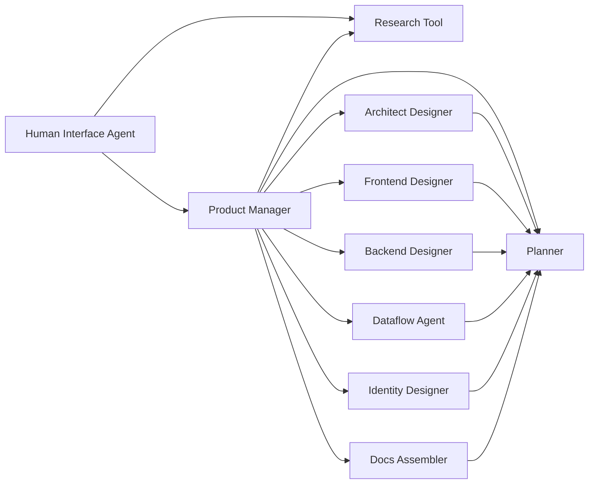

# n8n Design Workflow

## Flow Overview

## Stage Notes

### Human Interface Agent
- **Expected input:** Raw stakeholder goals, constraints, and clarifying questions gathered from the requestor.
- **Expected output:** Structured design brief with objectives, success criteria, and open research questions, coordinating with the research and product manager peers as needed.
- **Prompt template:** [`docs/prompts/human-interface-agent.gpt5.md`](../prompts/human-interface-agent.gpt5.md)

### Research Tool
- **Expected input:** Design brief plus outstanding questions that require market, technical, or dependency investigation from either the human interface agent or the product manager.
- **Expected output:** Curated findings, references, and risk flags published for the product manager and human interface agent to consume and iterate on.
- **Prompt template:** [`docs/prompts/design.research-analyst.gpt5.md`](../prompts/design.research-analyst.gpt5.md)

### Product Manager
- **Expected input:** Research pack and clarified stakeholder goals from the human interface agent, along with iterative updates retrieved from the research tool when invoked as a peer.
- **Expected output:** Prioritized problem statement, acceptance criteria, and task routing for each specialist design agent, plus a finalized design package handed to the planner to break the feature into ChatGPT Codex-ready tasks. Acts as the orchestrator, calling the research peer and design specialists as tools when further detail is required.
- **Prompt template:** [`docs/prompts/product-manager-agent.gpt5.md`](../prompts/product-manager-agent.gpt5.md)

### Design Specialist Agents
- **Architect Designer**
  - **Expected input:** Product manager brief with functional scope and architectural constraints.
  - **Expected output:** High-level system diagrams and component responsibilities.
  - **Prompt template:** [`docs/prompts/design.architect.gpt5.md`](../prompts/design.architect.gpt5.md)
- **Frontend Designer**
  - **Expected input:** UI requirements, user journeys, and platform guidelines from the product manager.
  - **Expected output:** UI narratives, wireframes, or component specs ready for planning.
  - **Prompt template:** [`docs/prompts/design.frontend-designer.gpt5.md`](../prompts/design.frontend-designer.gpt5.md)
- **Backend Designer**
  - **Expected input:** Service expectations, data contracts, and scalability goals from the product manager.
  - **Expected output:** API designs, storage models, and integration notes.
  - **Prompt template:** [`docs/prompts/design.backend-designer.gpt5.md`](../prompts/design.backend-designer.gpt5.md)
- **Dataflow Agent**
  - **Expected input:** Cross-service data requirements and event lifecycles provided by the product manager.
  - **Expected output:** Sequenced data pipelines and synchronization strategies.
  - **Prompt template:** [`docs/prompts/design.dataflow-agent.gpt5.md`](../prompts/design.dataflow-agent.gpt5.md)
- **Identity Designer**
  - **Expected input:** Authentication, authorization, and compliance needs from the product manager.
  - **Expected output:** Identity flows, role matrices, and security considerations.
  - **Prompt template:** [`docs/prompts/design.identity-designer.gpt5.md`](../prompts/design.identity-designer.gpt5.md)
- **Docs Assembler**
  - **Expected input:** Approved drafts and technical notes from all design specialists.
  - **Expected output:** Consolidated design narrative aligned with publishing standards.
  - **Prompt template:** [`docs/prompts/design.docs-assembler.gpt5.md`](../prompts/design.docs-assembler.gpt5.md)

### Planner
- **Expected input:** Finalized specialist outputs with traceable assumptions and dependencies, including the consolidated package from the product manager.
- **Expected output:** Structured implementation plan, milestone sequencing, and task envelopes for integration, breaking the feature into actionable work that is ready for execution by ChatGPT Codex.
- **Prompt template:** [`docs/prompts/design.planner.gpt5.md`](../prompts/design.planner.gpt5.md)
