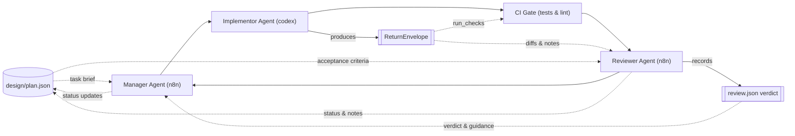

# n8n Integration Workflow

## Flow Overview

## Stage Notes

### Manager Agent (n8n)
- **Consumes:** `design/plan.json` for DAG ordering, dependency gates, and acceptance criteria; prior `review.json` verdicts to know whether retries or escalations are required.
- **Produces:** Task assignment payloads for the implementor plus status updates persisted back into `design/plan.json` once a reviewer verdict arrives.
- **Prompt template:** [`docs/prompts/integration.manager.gpt5.md`](../prompts/integration.manager.gpt5.md)
- **Artifact handling:** Updates `plan.json.tasks[].status`, `notes[]`, and timestamps using the reviewer’s verdict so downstream runs read the canonical plan state.

### Implementor Agent (codex)
- **Consumes:** The task brief (id, scope, files-to-touch) routed from `plan.json`, along with the repository snapshot required to compute diffs and hashes.
- **Produces:** A `ReturnEnvelope` validating `specs/ReturnEnvelope.schema.json` that captures diffs, new files, hash checks, test commands, and cost notes. n8n persists this envelope under the active run in `/state/runs/<run-id>/task-<task-id>.json` so the reviewer and manager can reload it deterministically.
- **Prompt template:** [`docs/prompts/integration.implementor.gpt5.md`](../prompts/integration.implementor.gpt5.md)
- **Artifact handling:** Supplies the `ReturnEnvelope` to both the CI gate (for executing `run_checks[]`) and the reviewer.

### CI Gate
- **Consumes:** `ReturnEnvelope.run_checks[]` commands, the repository diff staged from the implementor, and any required environment variables/tooling declared in the plan entry.
- **Produces:** Deterministic CI logs (pass/fail status, lint/test output) that the reviewer inspects before issuing a verdict. Failures trigger an immediate return to the implementor with logs attached.
- **Artifact handling:** Feeds pass/fail status and logs back to the orchestrator so the reviewer and manager can act on objective gating results.

### Reviewer Agent (n8n)
- **Consumes:** The task entry from `design/plan.json`, the implementor’s `ReturnEnvelope`, and CI logs.
- **Produces:** A `review.json` artifact validating `specs/review.schema.json` with `verdict`, `errors[]`, retry/escalation flags, and reasoning notes. The orchestrator stores this alongside the envelope within the run state for audit.
- **Prompt template:** [`docs/prompts/integration.reviewer.gpt5.md`](../prompts/integration.reviewer.gpt5.md)
- **Artifact handling:** On `pass`, signals the manager to mark the task `done` in `plan.json`; on `fail`, the verdict keeps the task `pending` and appends reviewer guidance to `notes[]` for the implementor’s next attempt.

### Manager Close-Out Loop
- **Consumes:** Reviewer `review.json` artifacts and updated CI status to decide whether to advance, retry, or escalate a task.
- **Produces:** The next dispatch cycle plus the authoritative `design/plan.json` state used by downstream CD agents once every integration task is `done`.
- **Artifact handling:** Ensures `plan.json` remains schema-valid after each update and archives ReturnEnvelopes/review artifacts as part of the run audit trail.
